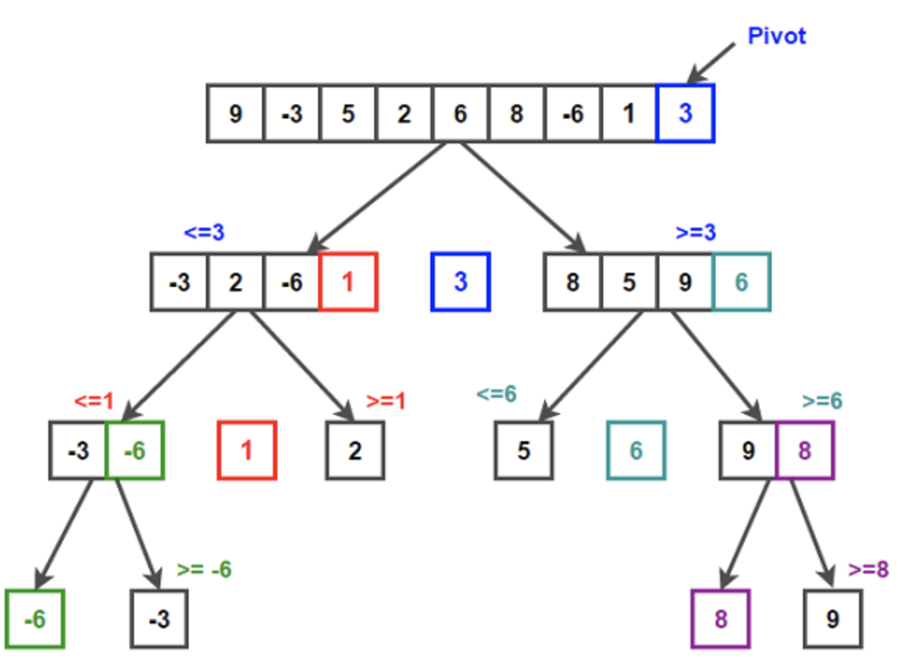

# Algorithms

## Binary Search Algorithm
* Uses **Divide and Conquer** technique
* Using the medium value of an array, if the target is greater than the medium value, discard all the values that is left of the target
* Time  = O(log2n)
* Space = O(1)
```
  def binary_search(array, target)
    left = 0
    right = array.length - 1
    while (left <= right)
      mid = (left + right ) / 2
      if target == array[mid]
        return mid
      elsif target < nums[mid]
        right = mid - 1
      else
        left = mid + 1
    end
  end
```

## Merge Sort
* Uses **Divide and Conquer** technique

## Quick Sort
* 2 or 3 times faster than merge-sort and heap sort when implemented well
* Average = O(n.log(n))
* Worst = O(n^2) - highly
1. Pick a **pivot**
  * i.e. a number in the array, usually it's the left or the right most position
2. Reorder into subarrays, where the values are separated whether they are greater or lesser than the pivot
3. Recur based on the new subarrays
  * i.e. pick a pivot on those sub arrays and separate

